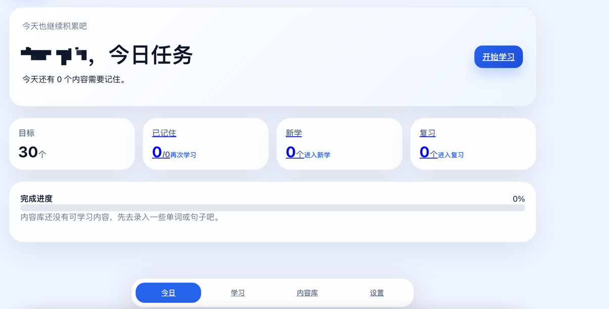

# sanxiu

>一个基于 Node.js 的轻量级个人散修技能工具, 包括不限于English技能,股票分析等

[](LICENSE)


## 🚀 快速开始

- 前端：Vite + React + TypeScript
  - 响应式 H5 页面，手机和 PC 均可访问
  - 使用 Web Speech API 实现单词/句子朗读
- 后端：Node.js + Express + TypeScript
  - REST API
  - JWT 登录鉴权
  - bcryptjs 密码哈希
- 数据库：SQLite + better-sqlite3
  - 单文件数据库，适合 MVP、本地部署和后续迁移到 PostgreSQL/MySQL

### 环境要求

- Node.js >= 18
- npm >= 9

## 环境变量

登录成功后前端会把 JWT token 保存到浏览器 `localStorage`，默认有效期为 90 天。关闭浏览器不会丢失登录态；手动退出登录、清除网站数据、token 过期或更换 `JWT_SECRET` 后需要重新登录。

默认账号配置为必填项。代码不再内置可用的默认用户名和密码；如果缺少 `DEFAULT_USER1_*` 或 `DEFAULT_USER2_*` 相关变量，后端会启动失败。真实密码只应写入本地或服务器 `.env`，不要提交到仓库。

```zsh
export PORT=3001
export JWT_SECRET='replace-with-a-strong-secret'
export DB_PATH='./server/data/app.db'
export DEFAULT_USER1_NAME='xxx'
export DEFAULT_USER1_EMAIL='xxx@xxx'
export DEFAULT_USER1_PASSWORD='replace-with-strong-password'
export DEFAULT_USER2_NAME='xxx1'
export DEFAULT_USER2_EMAIL='xxx2@xxx'
export DEFAULT_USER2_PASSWORD='replace-with-strong-password'
```

使用“自动生成中文释义”和“生成对话”需要配置 OpenAI 兼容的 AI 接口，例如 DeepSeek：

```zsh
export DEEPSEEK_API_KEY='your-api-key'
export DEEPSEEK_BASE_URL='https://api.deepseek.com'
export DEEPSEEK_MODEL='deepseek-chat'
```

也可以使用通用变量名 `AI_API_KEY` / `AI_BASE_URL` / `AI_MODEL`。项目启动时会自动读取项目根目录的 `.env` 文件；如果不配置 `DEEPSEEK_API_KEY` 或 `AI_API_KEY`，普通学习、复习、朗读、内容 CRUD 等简单功能 仍可使用，AI 生成类按钮会提示需要先配置 AI。

## SQLite 部署说明

当前项目面向个人用户使用，SQLite 可以直接部署到本地、阿里云、腾讯云或亚马逊云的单台服务器上。

建议：

- 使用云盘持久化保存 SQLite 数据文件。
- 通过 `DB_PATH` 指定数据库路径，例如 `/data/sanxiu/app.db`。
- 定时备份 SQLite 数据库文件。
- 单实例运行后端服务，避免多个 Node 进程同时写同一个 SQLite 文件。
- 对外访问时配置 HTTPS，后续做 PWA/浏览器通知也会需要 HTTPS。

腾讯云部署建议将 `DB_PATH` 设置为 `/data/sanxiu/app.db`，并使用 `sqlite3 .backup` 做定时一致性备份。


## 快速开始

```zsh
cd /sanxiu
npm run install:all
npm run dev
```

然后打开：

```text
http://localhost:5173
```

默认后端地址：

```text
http://localhost:3001
```


## 生产构建

```zsh
npm run build
npm start
```

生产模式下，后端会服务 `client/dist` 静态文件。
